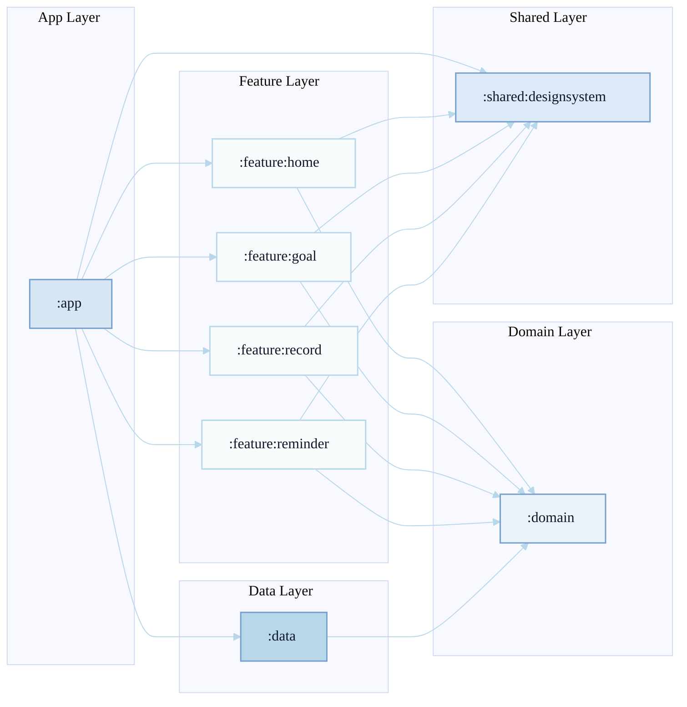

# 🏃‍♂️ RunningGoalTracker

[](https://kotlinlang.org)
[](https://github.com/google/ksp)
[]()
[]()
[]()
[]()
[](https://developer.android.com/jetpack/compose)
[](https://dagger.dev/hilt/)

**RunningGoalTracker**는 사용자의 러닝 목표를 설정하고 관리하며, 안드로이드의 활동 인식 기능을 통해 러닝 상태를 실시간으로 모니터링하는 앱입니다. 이 프로젝트는 최신 안드로이드 기술 스택과 Clean Architecture를 적용하여 개발되었습니다.

---

## 📝 프로젝트 개요

- **앱 이름**: `RunningGoalTracker`
- **목적**: 사용자가 꾸준히 러닝 습관을 형성하고 목표를 달성할 수 있도록 돕는 동기부여 앱입니다. 실시간 활동 인식을 통해 정확한 운동 상태를 추적하고, 개인화된 목표 설정과 스마트 리마인더 기능을 제공합니다.

---

## 🛠️ 기술 스택 (Tech Stack)

- **Language**: [Kotlin](https://kotlinlang.org/) (JVM 21)
- **UI**: [Jetpack Compose](https://developer.android.com/jetpack/compose) (BOM 기반 최신 버전)
- **Dependency Injection**: [Hilt (Dagger Hilt)](https://dagger.dev/hilt/)
- **Database**: [Room](https://developer.android.com/training/data-storage/room)
- **Architecture**: Clean Architecture 기반의 멀티 모듈 구조
- **Asynchronous**: [Coroutines & Flow](https://kotlinlang.org/docs/coroutines-guide.html)
- **Libraries**:
  - [Play Services Location & Activity Recognition](https://developer.android.com/training/location)
  - [Navigation Compose](https://developer.android.com/jetpack/compose/navigation)

---

## ✨ 주요 기능 (Core Features)

- **🏃 활동 인식 모니터링**: `ActivityRecognitionMonitor`를 사용하여 사용자의 현재 상태(걷기, 달리기, 정지 등)와 활동 로그를 실시간으로 추적합니다.
- **📊 러닝 기록 관리**: 사용자의 운동 시간, 거리, 평균 속도 등의 기록을 저장하고 언제든지 다시 확인할 수 있습니다.
- **🎯 목표 설정**: 주간 단위 또는 개인의 운동 능력에 맞춘 러닝 목표(거리, 시간)를 설정하고 달성률을 시각적으로 확인할 수 있습니다.
- **🔔 스마트 리마인더**: 사용자가 설정한 시간에 맞춰 운동을 독려하는 알림을 보냅니다.

---

## 🏗️ 프로젝트 구조 (Module Architecture)

본 프로젝트는 Clean Architecture 원칙에 따라 각 계층의 역할을 분리한 멀티 모듈 구조로 설계되었습니다.

```
:app
 ├── :feature
 │   ├── :home
 │   ├── :goal
 │   ├── :record
 │   └── :reminder
 ├── :data
 ├── :domain
 └── :shared
     └── :designsystem
```

- **`:domain`**: 순수 Kotlin 모듈로, 앱의 핵심 비즈니스 로직(UseCase, Entity)을 포함합니다. 다른 모듈에 대한 의존성이 없습니다.
- **`:data`**: 데이터 소스(Local-Room)를 관리하고, `domain` 모듈의 Repository 인터페이스를 구현합니다.
- **`:feature`**: 각 화면(Home, Goal, Record, Reminder)에 해당하는 기능 단위 모듈입니다. `domain`과 `shared:designsystem` 모듈에 의존합니다.
- **`:shared:designsystem`**: 공통으로 사용되는 UI 컴포넌트, 테마, 색상, 폰트 등을 정의하는 모듈입니다.
- **`:app`**: 최종 애플리케이션 모듈로, 위 모듈들을 통합하여 완전한 앱을 구성합니다.

### 의존성 구조 다이어그램


---

## 🚀 설치 방법 (Installation)

1.  **Repository 복제**:
    ```bash
    git clone https://github.com/your-username/RunningGoalTracker.git
    ```
2.  **Android Studio에서 열기**:
    - Android Studio를 실행하고 `File > Open`을 선택합니다.
    - 복제한 프로젝트 폴더를 선택합니다.
3.  **Gradle 동기화**:
    - 프로젝트를 열면 Android Studio가 자동으로 Gradle 동기화를 진행합니다.

---

## 🔒 필수 권한 설정

앱의 핵심 기능을 사용하기 위해 다음 권한이 필요합니다.

1.  **활동 인식 (Activity Recognition)**:
    - **목적**: 사용자의 현재 활동(걷기, 달리기 등)을 감지하여 자동으로 운동 상태를 추적합니다.
    - **설정 방법**: `설정 > 애플리케이션 > RunningGoalTracker > 권한`에서 '신체 활동' 권한을 허용해주세요.

2.  **위치 정보 기반 경로 측정(Location)**:
    - **목적**: 러닝 경로 및 이동 거리를 정확하게 측정하기 위해 사용됩니다.
    - **설정 방법**: 앱 실행 시 `앱 사용 중에만 허용`을 선택해 주세요. 더 높은 정확도를 위해 `정확한 위치 사용`을 권장합니다.

3.  **알림 (Notification)**:
    - **목적**: 운동 기록 상태 유지 및 설정된 시간에 알림을 보냅니다.
    - **설정 방법**: `권한 > 알림`에서 허용을 선택해 주세요.

앱 실행 시 권한 요청 대화상자가 나타나면 '허용'을 선택해주시기 바랍니다. 권한이 거부되면 일부 기능이 정상적으로 동작하지 않을 수 있습니다.
